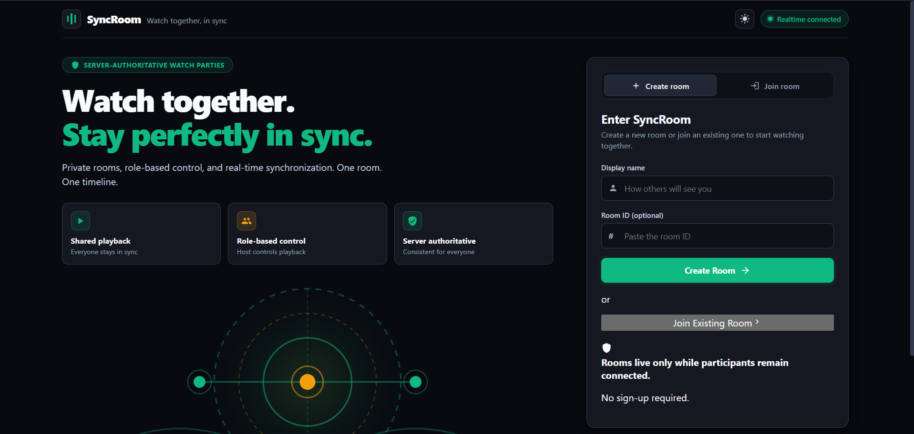
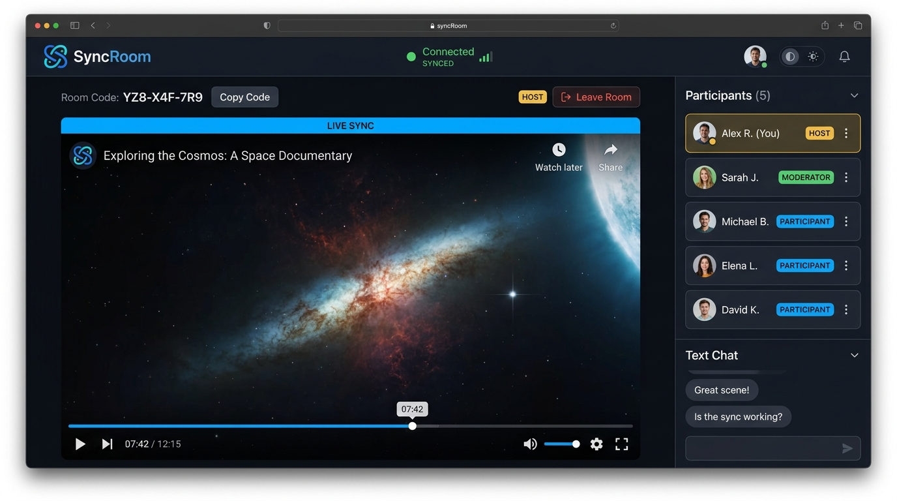
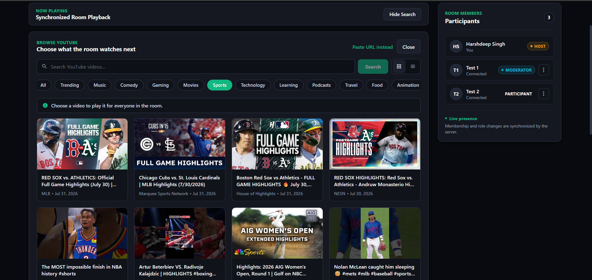
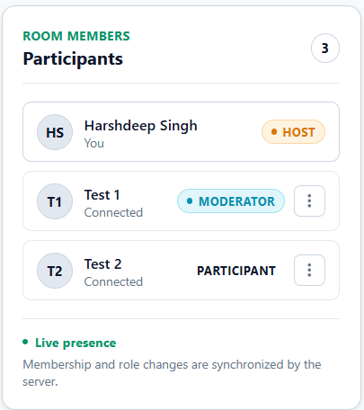
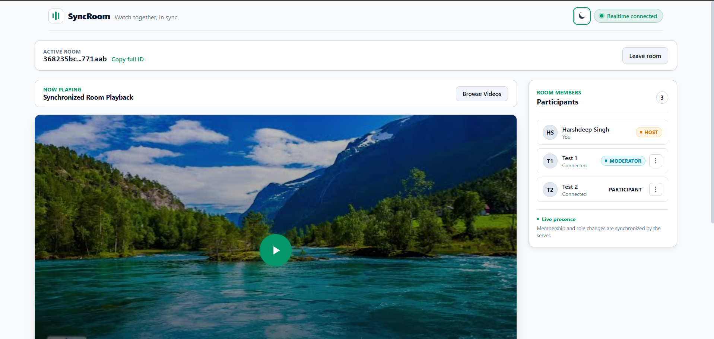
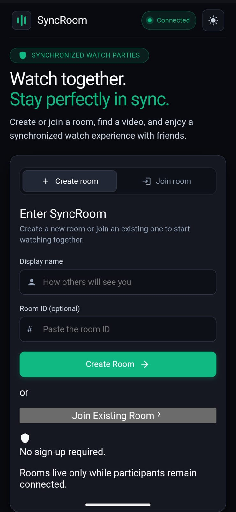
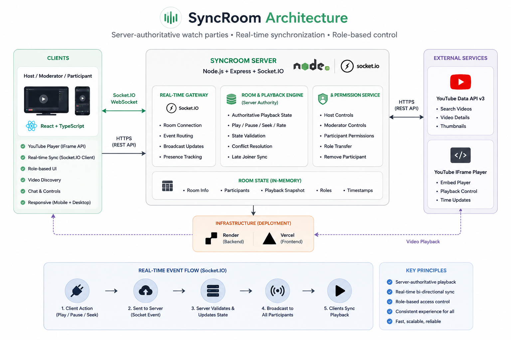
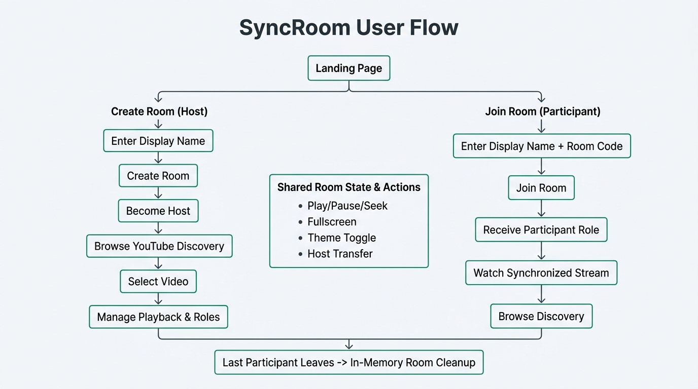

<div align="center">

# 🎬 SyncRoom

### Server-Authoritative Real-Time YouTube Watch Parties

Watch YouTube together with synchronized playback, role-aware controls, and real-time collaboration powered by Socket.IO.

<br />

[](https://react.dev/)
[](https://www.typescriptlang.org/)
[](https://expressjs.com/)
[](https://socket.io/)
[](https://vite.dev/)
[](https://nodejs.org/)
[](LICENSE)

<br />

### [Open Live Demo](https://syncroom-gamma.vercel.app/) · [Backend Health](https://syncroom-2l50.onrender.com/health)

</div>

---

## Overview

Watching YouTube together remotely sounds simple until playback starts drifting between participants.

One person pauses while another browser continues playing. A late participant joins several minutes behind. Multiple users attempt to control the same video, and the shared experience quickly becomes inconsistent.

**SyncRoom solves this by making the server—not the browser—the single source of truth.**

Every play, pause, seek, video change, role update, participant removal, and host transfer is validated by the backend before the updated room state is broadcast to connected clients.

The result is a synchronized watch-party experience in which every participant follows the same room timeline while control remains limited to authorized members.

SyncRoom was built as a production-inspired real-time engineering project focused on:

- Server-authoritative state management
- Typed Socket.IO communication
- Role-based authorization
- Playback drift correction
- Late-join synchronization
- Real YouTube discovery
- Responsive frontend architecture
- Automated integration testing
- Full-stack production deployment

---

## Why SyncRoom?

Most basic watch-party implementations allow each browser to manage its own playback state. That approach is easy to build, but it introduces several problems:

- Participants can drift onto different timestamps
- Conflicting playback commands create inconsistent state
- Late joiners may start from the beginning
- Unauthorized users may control the shared room
- Refreshes and reconnects can lose synchronization

SyncRoom uses a server-authoritative model instead.

```text
Client Action
     │
     ▼
Socket.IO Command
     │
     ▼
Server Validation
     │
     ▼
Authoritative Room Update
     │
     ▼
Broadcast Playback Snapshot
     │
     ▼
Every Client Synchronizes
```

This design keeps playback predictable, permissions enforceable, and future persistence easier to introduce.

---

## Key Features

### 🎥 Synchronized Watch Experience

Everyone in a room follows the same shared playback timeline.

When an authorized member plays, pauses, seeks, or changes the video, the command is validated by the server and broadcast to every connected participant.

The synchronization model supports:

- Shared play and pause state
- Server-authoritative seek operations
- Playback-rate-aware position calculation
- Drift correction between clients
- Late participant synchronization
- Reconnection-friendly room snapshots
- Shared video changes

---

### ⚡ Real-Time Room Communication

SyncRoom uses Socket.IO for low-latency, bidirectional communication between the React frontend and Express backend.

Real-time events include:

- Participant joined
- Participant left
- Participant removed
- Participant role updated
- Host transferred
- Playback updated
- Video changed
- Realtime authorization errors

All client and server event contracts are typed with TypeScript to reduce payload mismatches and make the event flow easier to maintain.

---

### 👥 Flexible Room Management

Every room supports three distinct roles.

| Role | Capabilities |
|---|---|
| **Host** | Controls playback, selects videos, assigns moderators, removes participants, and transfers host ownership |
| **Moderator** | Controls playback and selects the shared video |
| **Participant** | Watches synchronized playback and browses YouTube without changing shared room state |

The Host can:

- Promote a Participant to Moderator
- Demote a Moderator to Participant
- Remove a Participant or Moderator
- Transfer Host ownership
- Leave the room without breaking room authority

Role changes are broadcast immediately so every client updates permissions and interface state in real time.

---

### 🔎 YouTube Discovery Inside the Room

SyncRoom includes an integrated YouTube browsing experience powered by the YouTube Data API v3.

Users can:

- Search YouTube videos
- Browse curated watch-party categories
- Switch between grid and list layouts
- Load additional results
- View thumbnails, channels, and publish dates
- Paste a direct YouTube URL as a fallback

Discovery categories include:

- Trending
- Music
- Comedy
- Gaming
- Movies
- Sports
- Technology
- Learning
- Podcasts
- Travel
- Food
- Animation
- Live streams

Hosts and Moderators can select a result to play it for the room. Participants can browse freely, but the server prevents them from changing shared playback.

---

### 📺 Purpose-Built Playback Controls

The application provides custom room-level playback controls while preserving the embedded YouTube viewing experience.

Supported controls include:

- Play
- Pause
- Seek
- Shared timeline position
- Fullscreen mode
- Current playback status
- Live synchronization indicator

YouTube captions are not forced on by the application, while users can still use supported native player controls where available.

---

### 🧑‍🤝‍🧑 Live Presence and Participant Controls

The participant panel reflects room membership and authority in real time.

It includes:

- Online participant presence
- Host, Moderator, and Participant badges
- Role-management actions
- Host-transfer actions
- Participant removal
- Responsive action menus
- Automatic list updates after room events

Actions that require higher authority are only shown to eligible users and are still independently validated by the backend.

---

### 🌗 Dark and Light Themes

SyncRoom supports both dark and light themes across the complete application.

The theme system:

- Respects the system preference on first visit
- Persists the selected theme in local storage
- Avoids flashing the wrong theme during startup
- Applies consistent tokens across cards, controls, menus, inputs, and room surfaces
- Preserves readable contrast in both themes

---

### 📱 Responsive Across Devices

The interface adapts across desktop, tablet, and mobile layouts.

Responsive behavior includes:

- Two-column desktop landing layout
- Mobile-first single-column landing flow
- Full-width 16:9 video player
- Participant panel stacking on smaller screens
- Horizontally scrollable category chips
- Touch-friendly controls
- Responsive discovery grids
- Compact mobile header
- Safe dropdown positioning
- Controlled text wrapping and truncation

Desktop layout remains visually intact while mobile-specific behavior is isolated through scoped breakpoints.

---

### 🛡️ Server-Validated Room State

The backend validates every authoritative room action before updating shared state.

Protected actions include:

- Playback control
- Video selection
- Role assignment
- Participant removal
- Host transfer
- Room membership operations

This prevents the interface alone from becoming the security boundary and ensures unauthorized socket events are rejected at the server.

---

### 🧹 Ephemeral Room Lifecycle

SyncRoom currently uses lightweight in-memory room storage.

Rooms:

- Are created instantly
- Require no account
- Exist only while participants remain connected
- Are automatically deleted after the final participant leaves

This keeps Version 1 focused and lightweight while leaving a clear path toward database-backed rooms in a future release.

---

### 🚀 Production Deployment

SyncRoom is deployed as a full-stack application.

| Service | Platform |
|---|---|
| Frontend | Vercel |
| Backend | Render |
| Video Search | YouTube Data API v3 |
| Embedded Playback | YouTube IFrame API |

Production safeguards include:

- Environment validation with Zod
- Helmet security headers
- Controlled CORS configuration
- Structured Pino logging
- Health-check endpoint
- Typed production builds
- Automated backend integration tests

# 📸 Application Preview

SyncRoom is designed as a production-style collaboration platform rather than a simple video player. The following screenshots highlight the major workflows and interfaces available in Version 1.

---

## Landing Experience

The landing page introduces the platform, allows users to create or join a room instantly, and explains the core value proposition before entering a synchronized session.



---

## Shared Watch Room

The room interface is the primary collaboration workspace where synchronized playback, participant management, and room controls are combined into a single experience.



---

## Integrated YouTube Discovery

Instead of requiring users to leave the application, SyncRoom allows Hosts and Moderators to browse YouTube directly inside the room.

Features include:

- Search
- Curated categories
- Grid/List layouts
- Infinite discovery
- URL fallback
- Shared video selection



---

## Role Management

Hosts can manage room authority without interrupting playback.

Supported actions include:

- Promote Moderator
- Demote Moderator
- Transfer Host
- Remove Participant
- Live role synchronization



---

## Light Theme

SyncRoom includes a complete light theme while preserving accessibility and visual hierarchy.

Theme selection:

- Persists across sessions
- Honors system preference on first visit
- Uses shared design tokens
- Maintains contrast across components



---

## Mobile Experience

The application adapts to smaller screens with a mobile-first layout while preserving synchronized playback and participant management.

<p align="center">
  
</p>

---

## System Architecture

The following diagram summarizes the high-level architecture of SyncRoom.



---

# 🛠 Technology Stack

| Layer | Technologies |
|---------|--------------|
| **Frontend** | React 19, TypeScript, Vite |
| **Styling** | CSS3, Responsive Design |
| **State Management** | React Hooks |
| **Real-Time Communication** | Socket.IO |
| **Backend** | Node.js, Express 5 |
| **Validation** | Zod |
| **Security** | Helmet, CORS |
| **Logging** | Pino, Pino HTTP |
| **Video Platform** | YouTube Data API v3, YouTube IFrame API |
| **Testing** | Node Test Runner |
| **Build Tools** | TypeScript, tsx |
| **Deployment** | Vercel (Frontend), Render (Backend) |
| **Version Control** | Git, GitHub |

---

# 🔄 User Flow

The following diagram illustrates the primary user journey through SyncRoom.



A typical watch session follows these steps:

```text
Landing Page
      │
      ▼
Create Room / Join Room
      │
      ▼
Host Creates Room
      │
      ▼
Participants Join
      │
      ▼
Host Searches YouTube
      │
      ▼
Video Selected
      │
      ▼
Server Validates Action
      │
      ▼
Shared Playback Broadcast
      │
      ▼
Everyone Watches Together
```

The server remains the authoritative source of truth throughout the session. Every playback action is validated before the updated room state is synchronized across connected clients.

---

# 🏗 Engineering Architecture

Unlike traditional peer-controlled watch parties, SyncRoom follows a **server-authoritative architecture**.

Clients never synchronize directly with each other.

Instead, every shared action flows through the backend before any participant updates their local playback state.

This architecture provides several important benefits:

- Consistent playback synchronization
- Prevention of conflicting room state
- Predictable role enforcement
- Late participant recovery
- Simpler future persistence
- Better scalability for additional room features

The synchronization lifecycle is shown below.

```text
Host / Moderator
        │
        ▼
Socket.IO Event
        │
        ▼
Express Server
        │
        ▼
Validate Permission
        │
        ▼
Update Authoritative Room State
        │
        ▼
Broadcast Playback Snapshot
        │
        ▼
All Connected Participants
        │
        ▼
Local Player Synchronization
```

This design ensures that browsers never become the source of truth for shared playback.

---

# 🏛 Engineering Decisions

Several architectural decisions were intentionally made while building SyncRoom.

## Server-Authoritative Synchronization

The server owns playback state rather than individual clients.

This prevents playback drift, conflicting commands, and inconsistent room state.

---

## Socket.IO for Real-Time Communication

Socket.IO provides reliable low-latency bidirectional communication and automatic reconnection, making it well suited for synchronized collaboration.

---

## In-Memory Room Storage

Version 1 intentionally stores room state in memory.

This keeps the assignment lightweight while allowing future migration to PostgreSQL or Redis without changing the synchronization model.

---

## Role-Based Authorization

Authorization is enforced on the server rather than relying solely on the user interface.

Even if a client emits unauthorized Socket.IO events manually, the backend validates permissions before applying any room changes.

---

## Shared TypeScript Contracts

Frontend and backend communicate using strongly typed payloads, reducing runtime mismatches and making event evolution safer.

---

## Progressive Enhancement

The project was intentionally designed so future features such as authentication, private rooms, waiting-room admission, persistent history, and Redis synchronization can be added without requiring a complete architectural rewrite.

# 📂 Project Structure

SyncRoom is organized as a lightweight monorepo containing separate frontend and backend workspaces.

```text
syncroom/
│
├── client/
│   ├── public/
│   ├── src/
│   │
│   ├── components/
│   │   ├── common/
│   │   ├── playback/
│   │   └── youtube/
│   │
│   ├── features/
│   │   ├── player/
│   │   └── syncroom/
│   │
│   ├── hooks/
│   ├── lib/
│   ├── types/
│   ├── App.tsx
│   ├── App.css
│   └── index.css
│
├── server/
│   ├── src/
│   │
│   ├── config/
│   ├── modules/
│   ├── realtime/
│   ├── routes/
│   ├── app.ts
│   └── server.ts
│
├── README-assets/
│
├── package.json
├── package-lock.json
└── README.md
```

The project is intentionally divided into independent frontend and backend applications while sharing a common repository for simpler development and deployment.

---

# 🚀 Getting Started

## Prerequisites

Before running SyncRoom locally, ensure the following software is installed:

| Requirement | Version |
|-------------|----------|
| Node.js | 22 or later |
| npm | Latest |
| Git | Latest |
| YouTube Data API v3 Key | Required |

---

## Clone the Repository

```bash
git clone https://github.com/harshdeepsingh888-ps/syncroom.git

cd syncroom
```

---

## Install Dependencies

Install all workspace dependencies from the repository root.

```bash
npm install
```

This installs packages for:

- Root workspace
- React frontend
- Express backend

---

# 🔐 Environment Variables

## Backend

Create:

```text
server/.env
```

Add:

```env
NODE_ENV=development

PORT=4000

CLIENT_ORIGIN=http://localhost:5173

YOUTUBE_DATA_API_KEY=YOUR_YOUTUBE_API_KEY
```

| Variable | Description |
|----------|-------------|
| NODE_ENV | Runtime environment |
| PORT | Backend server port |
| CLIENT_ORIGIN | Allowed frontend origin |
| YOUTUBE_DATA_API_KEY | API key used for YouTube search |

---

## Frontend

Create:

```text
client/.env
```

```env
VITE_SERVER_URL=http://localhost:4000
```

---

# 💻 Running the Application

## Start the Backend

```bash
npm run dev:server
```

The backend starts on:

```
http://localhost:4000
```

---

## Start the Frontend

Open another terminal.

```bash
npm run dev:client
```

The frontend starts on:

```
http://localhost:5173
```

---

Open the browser:

```
http://localhost:5173
```

Create a room and open another browser window (or Incognito) to join as a second participant.

---

# 🧪 Testing

SyncRoom includes automated backend tests covering synchronization and room management behaviour.

Run all tests:

```bash
npm test
```

---

Run TypeScript checking:

```bash
npm run typecheck
```

---

Generate production builds:

```bash
npm run build
```

---

Current automated coverage includes:

### YouTube Search

- Missing query validation
- Invalid query validation
- Upstream API failure handling
- Response normalization

---

### Room Lifecycle

- Room creation
- Participant join
- Participant leave
- Automatic cleanup
- Reconnection behaviour

---

### Playback Synchronization

- Play
- Pause
- Seek
- Late join synchronization
- Authoritative playback state

---

### Authorization

- Host permissions
- Moderator permissions
- Participant restrictions
- Host transfer
- Role assignment
- Participant removal

---

# 🌍 Deployment

SyncRoom is deployed as separate frontend and backend services.

| Component | Platform |
|-----------|----------|
| Frontend | Vercel |
| Backend | Render |

---

## Production URLs

### Frontend

```
https://syncroom-gamma.vercel.app
```

---

### Backend Health

```
https://syncroom-2l50.onrender.com/health
```

---

### Deployment Pipeline

```text
Developer
      │
      ▼
GitHub
      │
      ├──────────────┐
      ▼              ▼
 Vercel         Render
Frontend        Backend
      │              │
      └──────┬───────┘
             ▼
     Production SyncRoom
```

Every push to the main branch automatically deploys the latest production version.

---

# 📈 Performance Considerations

Current Version 1 intentionally prioritizes architectural clarity over horizontal scalability.

Current implementation:

- In-memory room storage
- Lightweight room lifecycle
- Server-authoritative synchronization
- Automatic room cleanup
- Typed Socket.IO events

Future versions can introduce:

- PostgreSQL persistence
- Redis Pub/Sub
- Distributed Socket.IO adapters
- Horizontal scaling
- Rate limiting
- Response caching
- Authenticated user accounts

without requiring major architectural changes.

# ⚡ Engineering Challenges

Building a synchronized watch-party application involves considerably more than embedding a YouTube player. Throughout development, several engineering challenges had to be addressed to deliver a predictable, real-time experience.

## Playback Synchronization

One of the primary challenges was preventing playback drift between connected participants.

Instead of allowing browsers to synchronize directly, SyncRoom uses a **server-authoritative synchronization model** where every playback action is validated and distributed from the backend.

This approach ensures:

- Consistent playback position
- Predictable room state
- Reduced synchronization drift
- Reliable late-join recovery

---

## Role-Based Authorization

Multiple users share the same room, but not everyone should control playback.

To solve this, SyncRoom implements three permission levels:

- Host
- Moderator
- Participant

The backend validates every privileged Socket.IO event before applying room changes, preventing unauthorized users from manipulating shared playback.

---

## Real-Time State Management

Keeping every participant synchronized while users join, leave, reconnect, or transfer ownership required careful room-state management.

The server maintains a single authoritative room snapshot that is broadcast whenever meaningful changes occur.

---

## Responsive User Experience

The interface was designed to provide a consistent experience across desktop and mobile devices.

Special attention was given to:

- Responsive layouts
- Touch-friendly controls
- Adaptive navigation
- Mobile participant management
- Responsive YouTube discovery

---

## Future Scalability

Although Version 1 intentionally uses in-memory storage to keep the architecture lightweight, the synchronization model was designed so that persistent storage can be introduced with minimal architectural changes.

Future versions can migrate room state to PostgreSQL and Redis while preserving the existing communication flow.

---

# 🛣️ Future Roadmap

Version 2 focuses on transforming SyncRoom into a production-ready collaborative platform.

## Authentication & Identity

- Secure user authentication
- OAuth login providers
- Persistent user profiles
- Session management

---

## Room Experience

- Public rooms
- Private invite-only rooms
- Waiting room admission
- Room passwords
- Invite links
- Room history

---

## Collaboration

- Shared playlist queue
- Live chat
- Emoji reactions
- Voice presence indicators
- Collaborative video queue
- Watch history

---

## Infrastructure

- PostgreSQL persistence
- Redis caching
- Distributed Socket.IO adapters
- API rate limiting
- Response caching
- Monitoring & analytics

---

## Product Improvements

- Better mobile experience
- Accessibility improvements
- Internationalization
- Keyboard shortcuts
- Offline reconnection improvements
- Enhanced moderator capabilities

---

# 🤝 Contributing

Contributions, suggestions, and improvements are welcome.

If you would like to improve SyncRoom:

1. Fork the repository.
2. Create a feature branch.
3. Commit your changes.
4. Open a Pull Request.

For major architectural changes, please open an issue first so the proposed design can be discussed before implementation.

---

# 🙏 Acknowledgements

SyncRoom was developed as a production-inspired software engineering project to demonstrate:

- Real-time system design
- Full-stack application architecture
- Server-authoritative synchronization
- Modern React development
- Backend engineering with Express
- Socket.IO communication patterns
- Production deployment workflows

This project would not have been possible without the open-source ecosystem.

Special thanks to the teams behind:

- React
- TypeScript
- Express
- Socket.IO
- Vite
- Node.js
- Zod
- Pino
- Helmet
- YouTube Data API
- YouTube IFrame API

---

# 📊 Project Status

| Version | Status |
|----------|--------|
| **v1.0** | ✅ Released |
| **Frontend** | ✅ Production Ready |
| **Backend** | ✅ Production Ready |
| **Real-Time Synchronization** | ✅ Complete |
| **Role Management** | ✅ Complete |
| **YouTube Discovery** | ✅ Complete |
| **Responsive Layout** | ✅ Complete |
| **Automated Testing** | ✅ Passing |
| **Deployment** | ✅ Live |

---

# 📄 License

This project is licensed under the **MIT License**.

You are free to use, modify, and distribute this project in accordance with the terms of the license.

---

<div align="center">

## ⭐ If you found this project interesting, consider giving it a star on GitHub!

Built with ❤️ using **React**, **TypeScript**, **Express**, and **Socket.IO**.

</div>